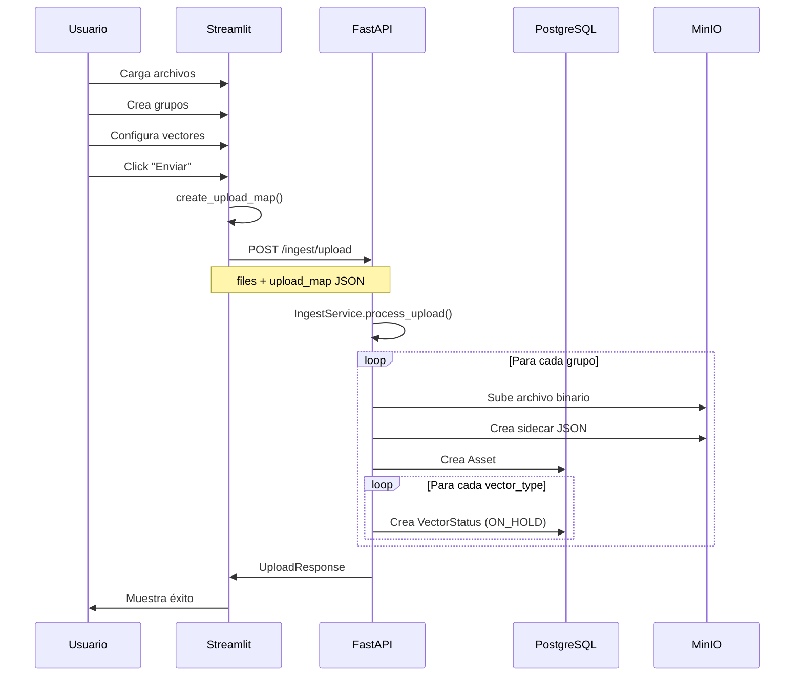
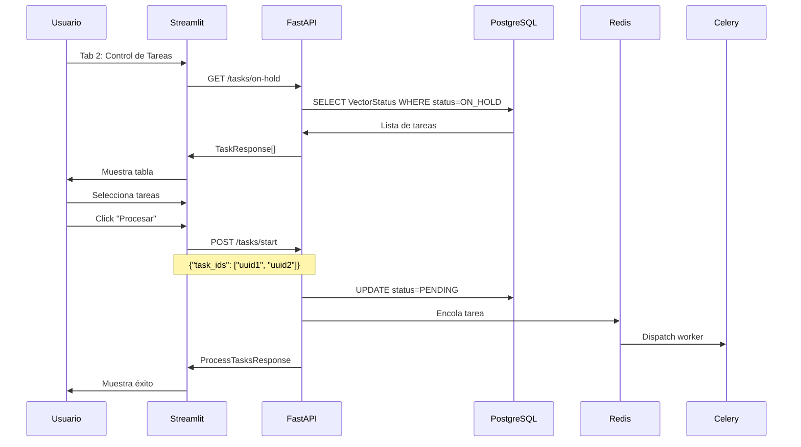

# GraphRAG Multimodal - Arquitectura Frontend-Backend

## 📐 Visión General

Este documento describe la integración entre la interfaz Streamlit y el backend FastAPI del sistema GraphRAG Multimodal.

## 🏗️ Arquitectura

```
┌─────────────────────────────────────────────────────────────┐
│                    USUARIO                                   │
└────────────────────────┬────────────────────────────────────┘
                         │
                         ▼
┌─────────────────────────────────────────────────────────────┐
│               STREAMLIT FRONTEND                             │
│  ┌─────────────────┐        ┌─────────────────┐             │
│  │  Tab 1: Ingesta │        │ Tab 2: Control  │             │
│  │  - File Upload  │        │ - Task List     │             │
│  │  - Grouping     │        │ - Start Process │             │
│  │  - Send to API  │        │ - Status Update │             │
│  └────────┬────────┘        └────────┬────────┘             │
│           │                          │                      │
└───────────┼──────────────────────────┼──────────────────────┘
            │                          │
            │  POST /ingest/upload     │  GET /tasks/on-hold
            │                          │  POST /tasks/start
            ▼                          ▼
┌─────────────────────────────────────────────────────────────┐
│                  FASTAPI BACKEND                             │
│  ┌──────────────────┐       ┌──────────────────┐            │
│  │ Ingest Router    │       │  Tasks Router    │            │
│  │ /ingest/*        │       │  /tasks/*        │            │
│  └────────┬─────────┘       └────────┬─────────┘            │
│           │                          │                      │
│           ▼                          ▼                      │
│  ┌──────────────────┐       ┌──────────────────┐            │
│  │ IngestService    │       │  VectorStatus    │            │
│  │ - Upload files   │       │  - Query tasks   │            │
│  │ - Create assets  │       │  - Update status │            │
│  └────────┬─────────┘       └────────┬─────────┘            │
└───────────┼──────────────────────────┼──────────────────────┘
            │                          │
            ▼                          ▼
┌─────────────────────────────────────────────────────────────┐
│                    PERSISTENCIA                              │
│  ┌──────────┐  ┌──────────┐  ┌──────────┐  ┌──────────┐    │
│  │PostgreSQL│  │  MinIO   │  │  Redis   │  │  Celery  │    │
│  │(Metadata)│  │(Binaries)│  │ (Queue)  │  │(Workers) │    │
│  └──────────┘  └──────────┘  └──────────┘  └──────────┘    │
└─────────────────────────────────────────────────────────────┘
```

## 🔄 Flujos de Datos

### Flujo 1: Ingesta de Archivos



**Ejemplo de Payload:**

```json
POST /ingest/upload

FormData:
  files: [File1, File2, File3]
  upload_map: [
    {
      "file_indices": [0, 1],
      "operation": "merge_ocr",
      "vector_types": ["text_chunk"],
      "user_notes": "Twitter thread",
      "discard_original": true
    },
    {
      "file_indices": [2],
      "operation": "standard",
      "vector_types": ["visual_siglip", "visual_semantic"],
      "discard_original": false
    }
  ]
```

### Flujo 2: Control de Tareas



## 📡 Endpoints API

### `/ingest` - Ingesta

#### `POST /ingest/upload`
**Descripción:** Carga archivos y crea assets en staging.

**Request:**
- `files`: List[UploadFile] - Archivos a subir
- `upload_map`: JSON string - Configuración de grupos

**Response:**
```json
{
  "success": true,
  "message": "Successfully processed 3 files into 2 assets",
  "assets_created": [
    {
      "id": "uuid",
      "filename": "merged_ocr_result.txt",
      "minio_path": "assets/...",
      "sidecar_path": "assets/.../metadata.json",
      "is_merged": true,
      "vector_tasks_created": 1,
      "created_at": "2025-12-28T17:00:00"
    }
  ],
  "total_files_processed": 3
}
```

### `/tasks` - Gestión de Tareas

#### `GET /tasks/on-hold`
**Descripción:** Lista todas las tareas en estado ON_HOLD.

**Response:**
```json
[
  {
    "id": "task-uuid",
    "asset_id": "asset-uuid",
    "filename": "image.jpg",
    "vector_type": "visual_siglip",
    "status": "on_hold",
    "created_at": "2025-12-28T17:00:00",
    "updated_at": "2025-12-28T17:00:00"
  }
]
```

#### `POST /tasks/start`
**Descripción:** Activa procesamiento de tareas seleccionadas.

**Request:**
```json
{
  "task_ids": ["uuid1", "uuid2", "uuid3"]
}
```

**Response:**
```json
{
  "success": true,
  "message": "Successfully queued 3 task(s) for processing",
  "tasks_updated": 3,
  "celery_task_ids": ["celery-uuid1", "celery-uuid2", "celery-uuid3"]
}
```

#### `GET /tasks/status/{task_id}`
**Descripción:** Obtiene el estado de una tarea específica.

**Response:**
```json
{
  "id": "task-uuid",
  "asset_id": "asset-uuid",
  "filename": "image.jpg",
  "vector_type": "visual_siglip",
  "status": "processing",
  "created_at": "2025-12-28T17:00:00",
  "updated_at": "2025-12-28T17:05:00"
}
```

## 🗄️ Modelos de Datos

### Frontend (Streamlit Session State)

```python
st.session_state = {
    'uploaded_files': List[UploadFile],
    'file_groups': List[Dict],
    'ungrouped_files': List[UploadFile],
    'next_group_id': int
}

# Estructura de un grupo:
group = {
    'id': 1,
    'files': ['image1.jpg', 'image2.jpg'],
    'operation': 'merge_ocr',
    'vectors': ['text_chunk', 'visual_semantic'],
    'discard_original': True,
    'notes': 'User context'
}
```

### Backend (SQLModel)

```python
# Asset
class Asset(SQLModel, table=True):
    id: UUID
    filename: str
    minio_path: str
    sidecar_path: str
    is_merged: bool
    created_at: datetime

# VectorStatus
class VectorStatus(SQLModel, table=True):
    id: UUID
    asset_id: UUID  # FK -> Asset
    vector_type: VectorType
    status: JobStatus  # ON_HOLD, PENDING, PROCESSING, COMPLETED, FAILED
    weaviate_uuid: Optional[str]
    error_message: Optional[str]
    created_at: datetime
    updated_at: datetime
```

## 🎨 UX Considerations

### Gestión de Estado
- **Persistencia:** Streamlit se recarga en cada interacción. Uso crítico de `st.session_state`.
- **Sincronización:** Al eliminar un grupo, los archivos vuelven a `ungrouped_files`.
- **Validación:** No permitir envío sin grupos creados.

### Feedback Visual
- **Spinners:** Durante llamadas API (`st.spinner()`)
- **Alertas:** Éxito (`st.success()`), errores (`st.error()`), advertencias (`st.warning()`)
- **Expanders:** Detalles de respuesta JSON, grupos creados

### Performance
- **Lazy Loading:** Tasks solo se cargan al abrir Tab 2
- **Batch Processing:** Envío de múltiples tareas en una sola llamada
- **Upload Limits:** Configurado en `.streamlit/config.toml` (500MB default)

## 🔐 Seguridad

### CORS
Si el frontend está en un dominio diferente al backend:

```python
# backend/app/__init__.py
from fastapi.middleware.cors import CORSMiddleware

app.add_middleware(
    CORSMiddleware,
    allow_origins=["http://localhost:8501"],
    allow_credentials=True,
    allow_methods=["*"],
    allow_headers=["*"],
)
```

### Secrets Management
- Nunca commitear `.streamlit/secrets.toml`
- Usar variables de entorno en producción
- Template `.toml.template` para documentación

## 🧪 Testing

### Frontend Manual Testing
1. Cargar archivos → verificar aparecen en "Sin Asignar"
2. Crear grupo → verificar desaparecen de "Sin Asignar"
3. Eliminar grupo → verificar vuelven a "Sin Asignar"
4. Enviar al servidor → verificar response correcta
5. Tab 2 → verificar tasks aparecen
6. Procesar tasks → verificar estado cambia a PENDING

### Backend API Testing
```bash
# Test upload endpoint
curl -X POST "http://localhost:8000/ingest/upload" \
  -F "files=@test1.jpg" \
  -F "files=@test2.jpg" \
  -F 'upload_map=[{"file_indices":[0,1],"operation":"standard","vector_types":["visual_siglip"],"discard_original":false}]'

# Test on-hold tasks
curl "http://localhost:8000/tasks/on-hold"

# Test start processing
curl -X POST "http://localhost:8000/tasks/start" \
  -H "Content-Type: application/json" \
  -d '{"task_ids":["uuid1","uuid2"]}'
```

## 📝 Notas de Implementación

### Pendientes (TODOs)
1. **Celery Integration:** `/tasks/start` actualmente marca tasks como PENDING pero no dispara Celery workers
2. **Polling:** Implementar auto-refresh en Tab 2 (opcional)
3. **Filtros:** Agregar filtros por vector_type, fecha, status
4. **Paginación:** Para grandes volúmenes de tasks
5. **Bulk Actions:** Selección masiva de tasks

### Decisiones de Diseño
- **Form vs Direct State:** Uso de `st.form()` en group builder para evitar re-renders
- **Multipart Upload:** FastAPI recibe archivos como `List[UploadFile]` con índices en JSON
- **Staging Philosophy:** Todo empieza en ON_HOLD, procesamiento manual por usuario

## 🚀 Deployment

### Local Development
```bash
# Terminal 1: Backend
cd backend
poetry install
poetry run uvicorn app:app --reload

# Terminal 2: Frontend
cd frontend
python -m venv venv
venv\Scripts\activate  # Windows
pip install -r requirements.txt
streamlit run app.py
```

### Production Considerations
- Usar Gunicorn/Uvicorn workers para FastAPI
- Proxy reverso (Nginx) para routing
- Streamlit Cloud o self-hosted con systemd
- Variables de entorno en lugar de secrets.toml

## 📚 Referencias

- [Streamlit Docs](https://docs.streamlit.io)
- [FastAPI Multipart](https://fastapi.tiangolo.com/tutorial/request-files/)
- [SQLModel](https://sqlmodel.tiangolo.com)
- [Celery](https://docs.celeryq.dev)
