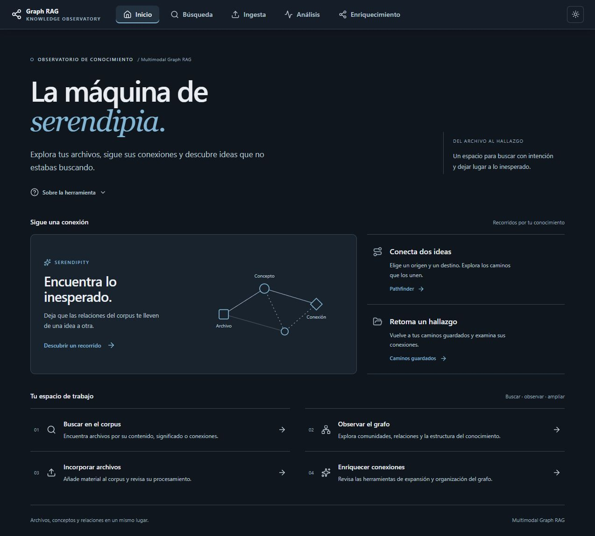
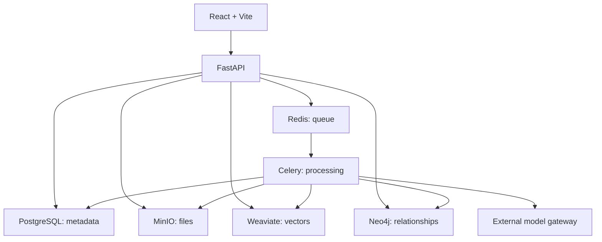

# GraphRAG Multimodal — Knowledge Observatory

[Español (principal)](README.md) · **English**

Explore your files, follow their connections, and discover ideas you were not looking for.

GraphRAG combines multimodal search, a knowledge graph, and fuzzy weighted relationships to explore documents, images, audio, and video. Its purpose is to retrieve relevant material and reveal connections between files, concepts, and entities.



*The home page offers two starting points: search with an intention, or follow connections toward an unexpected discovery.*

## What is it for?

- **Retrieve knowledge:** find files through keywords, meaning, or visual similarity.
- **Connect ideas:** explore concepts, people, places, and other entities linked to source files.
- **Investigate relationships:** trace paths between two nodes with Pathfinder or explore Serendipity walks.
- **Review a corpus:** inspect communities, isolated nodes, and weights; enrich and clean relationships.

For example, a collection of notes, photographs, and interviews can be explored through a shared topic and then through connections between its entities. This is an illustrative use case; results depend on the corpus, models, and graph quality.

A weight between 0 and 1 describes relationship strength according to the method used; it is not a verified probability. Treat a connection as a research lead and check the original files.

## From files to discoveries

1. **Add** files or text in Ingesta y Agrupación.
2. **Process and review** tasks and proposed entities.
3. **Search** text, visual, audio, and memory spaces.
4. **Explore** relationships, paths, and graph structure.
5. **Revisit** paths you have saved.

### Search in several modes


*Semantic search combines keywords (BM25) with vector similarity. The tabs let you ask different questions of the same corpus.*

| UI tab | Purpose |
|---|---|
| Semántica | Search by text and adjust the balance between keywords and meaning. |
| Visual | Find content similar to an image using SigLIP. |
| Multimodal | Combine an image and text. |
| Grafo | Traverse explicit relationships using a weight threshold. |
| Grafo Difuso | Start from vector similarity and expand graph connections. |
| Comparativa | Compare the available retrieval systems. |

### Explore connections


*The dashboard brings together tools for studying corpus structure and discovering paths. Pathfinder connects two nodes; Serendipity explores unexpected connections.*

Analysis includes communities, semantic bridges, Pathfinder, Serendipity, fog of war, heatmaps, chord diagrams, radial trees, PageRank, abstract concepts, orphans, weight distributions, and saved paths. Enrichment provides weight adjustment, connection expansion, and entity cleanup.

These are actual local-app screenshots showing navigation and configuration, without simulated results. The interface remains mainly Spanish, with some English names. The [visual user guide](docs/en/USAGE_GUIDE.md) explains ingestion and Pathfinder step by step.

## Getting started

From the repository root, with Docker and Compose v2:

```powershell
# Preserve an existing .env.
if (!(Test-Path .env)) { Copy-Item .env.docker .env }
# Configure credentials and LLM_GATEWAY_URL before starting.
docker compose up --build -d
docker compose ps
```

Open the [app](http://localhost) and [interactive API documentation](http://localhost:8000/docs).

The model gateway is external and is not included in Compose. Model operations require a gateway compatible with the backend clients. For transcription, enable either the `cpu` or `gpu` Whisper profile. Communities and PageRank require GDS; the root Compose installs only APOC, so these tools require a compatible GDS installation.

See [Quickstart](docs/en/QUICKSTART.md) for ports, profiles, and local development.

## Architecture



| Location | Contents |
|---|---|
| `search-app/` | React, TypeScript, and Vite interface. |
| `backend/app/` | API, models, schemas, and services. |
| `backend/worker/` | Asynchronous Celery processing. |
| `backend/shared/` | Storage and database clients. |
| `frontend/` | Legacy Streamlit panel. |
| `docs/` | Guides, references, and screenshots. |
| `docker-compose.yml` | Application and infrastructure services. |

## Documentation

- [English documentation index](docs/en/README.md) · [Spanish documentation](docs/README.md)
- [Quickstart](docs/en/QUICKSTART.md) · [Visual user guide](docs/en/USAGE_GUIDE.md)
- [Architecture (Spanish)](docs/general/ARCHITECTURE.md) · [Diagrams (Spanish)](docs/general/diagrams.md)
- [Fuzzy logic (Spanish)](docs/backend/FUZZY_LOGIC.md) · [Enrichment (Spanish)](docs/backend/enrichment_summary.md)

Spanish remains the primary language. This overview, the quickstart, and the visual guide are available in English. The English index labels technical references that remain in Spanish.

## License and citation

GNU AGPL v3. See [LICENSE](LICENSE). For academic use, see the [citation in the primary README](README.md#cómo-citar-este-proyecto-citation).
