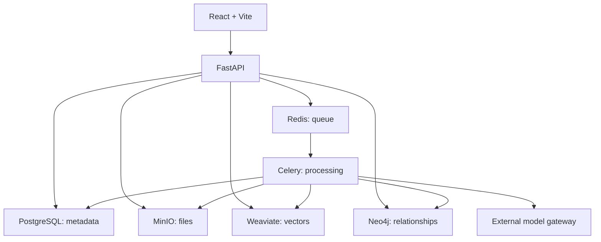

# GraphRAG Multimodal — Knowledge Observatory

[](https://doi.org/10.5281/zenodo.23228850)

[Español (principal)](README.md) · **English**

From retrieval to association and serendipitous discovery.

GraphRAG Multimodal / The Associative Engine is an experimental knowledge observatory combining multimodal retrieval, a knowledge graph, and fuzzy weighted relationships.

The project begins with a research question:

> Can a knowledge system help us discover relationships we did not know we were looking for?

## Intellectual motivation

Two influences motivated this computational question:

- **Douglas Hofstadter and Emmanuel Sander, *Surfaces and Essences*:** analogy and its role in categorization.
- **Marcel Danesi, *Poetic Logic and the Origins of the Mathematical Imagination*:** poetic thought, metaphor, abduction, and conceptual creation.

These are intellectual influences, not validation of the architecture. The system does not claim to model or reproduce human cognition. The design question is:

> What would a knowledge exploration system look like if relationships did not always have to be binary, and if weak or indirect associations could remain explorable?

Fuzzy weighted graphs are one experimental response: the computational hypothesis is that keeping different degrees of relationship available for traversal may offer research leads beyond direct similarity.

Conventional retrieval primarily optimizes for relevance. GraphRAG combines that search with exploration of weaker, indirect, and unexpected relationships through fuzzy graph traversal, Pathfinder, and Serendipity.

The system combines multimodal search, a knowledge graph, and fuzzy weighted relationships to explore documents, images, audio, and video. Its purpose is to retrieve relevant material and make possible connections between files, concepts, and entities visible: from files to discoveries.

Three ways to explore the same corpus:

- **Retrieval:** find what is relevant to a query.
- **Pathfinder:** choose a source and a destination and inspect different possible routes between them.
- **Serendipity:** leave the destination open and let its own exploration rules suggest an unexpected association. It is not another version of Pathfinder, and Pathfinder need not reproduce its results.

The public example **Astrónomo ciego ↔ Abandono de lo superficial** contains five saved node sequences. Home condenses two; complete routes, assets, and relationships remain inspectable. This illustrates corpus behavior, not general validation. See the Spanish [curation and caveats](docs/presentation/CANONICAL_EXAMPLE.md), [3–5 minute demo](docs/presentation/DEMO.md), [capture checklist](docs/presentation/CAPTURES.md), and [future research directions](docs/research/FUTURE_WORK.md).


*Home in light mode: two condensed real routes between Astrónomo ciego and Abandono de lo superficial. Dotted lines omit intermediate assets; they are not direct relationships between concepts.*

## What is it for?

- **Retrieve knowledge:** find files through keywords, meaning, or visual similarity.
- **Connect ideas:** explore concepts, people, places, and other entities linked to source files.
- **Investigate relationships:** trace paths between two nodes with Pathfinder or explore Serendipity walks.
- **Review a corpus:** inspect communities, isolated nodes, and weights; enrich and clean relationships.

For example, a collection of notes, photographs, and interviews can be explored through a shared topic and then through connections between its entities. This is an illustrative use case; results depend on the corpus, models, and graph quality.

A fuzzy weight between 0 and 1 describes relationship strength according to the method used; it is not a probability of truth. Unexpected paths are research leads, not conclusions. The system exposes paths and source material for human evaluation: inspect each link, open the files, and check their content before deciding whether a connection is meaningful.

## From files to discoveries

1. **Add** files or text in Ingesta y Agrupación.
2. **Process and review** tasks and proposed entities.
3. **Search** text, visual, audio, and memory spaces.
4. **Explore** relationships, paths, and graph structure.
5. **Revisit** paths you have saved.

### Search in several modes


*Semantic search combines keywords (BM25) with vector similarity. The tabs let you ask different questions of the same corpus.*

| UI tab | Purpose |
|---|---|
| Semántica | Search by text and adjust the balance between keywords and meaning. |
| Visual | Find content similar to an image using SigLIP. |
| Multimodal | Combine an image and text. |
| Grafo | Traverse explicit relationships using a weight threshold. |
| Grafo Difuso | Start from vector similarity and expand graph connections. |
| Comparativa | Compare the available retrieval systems. |

### Explore connections


*The dashboard brings together tools for studying corpus structure and discovering paths. Pathfinder connects two nodes; Serendipity explores unexpected connections.*

Analysis includes communities, semantic bridges, Pathfinder, Serendipity, fog of war, heatmaps, chord diagrams, radial trees, PageRank, abstract concepts, orphans, weight distributions, and saved paths. Enrichment provides weight adjustment, connection expansion, and entity cleanup.

These are actual local-app screenshots. Home shows the real saved example; the other screenshots show navigation and configuration, without simulated results. The interface remains mainly Spanish, with some English names. The [visual user guide](docs/en/USAGE_GUIDE.md) explains ingestion and Pathfinder step by step.

## Getting started

From the repository root, with Docker and Compose v2:

```powershell
# Preserve an existing .env.
if (!(Test-Path .env)) { Copy-Item .env.docker .env }
# Configure credentials and LLM_GATEWAY_URL before starting.
docker compose up --build -d
docker compose ps
```

Open the [app](http://localhost) and [interactive API documentation](http://localhost:8000/docs).

The model gateway is external and is not included in Compose. Model operations require a gateway compatible with the backend clients. For transcription, enable either the `cpu` or `gpu` Whisper profile. Communities and PageRank require GDS; the root Compose installs only APOC, so these tools require a compatible GDS installation.

See [Quickstart](docs/en/QUICKSTART.md) for ports, profiles, and local development.

## Architecture



| Location | Contents |
|---|---|
| `search-app/` | React, TypeScript, and Vite interface. |
| `backend/app/` | API, models, schemas, and services. |
| `backend/worker/` | Asynchronous Celery processing. |
| `backend/shared/` | Storage and database clients. |
| `frontend/` | Legacy Streamlit panel. |
| `docs/` | Guides, references, and screenshots. |
| `docker-compose.yml` | Application and infrastructure services. |

## Documentation

- [English documentation index](docs/en/README.md) · [Spanish documentation](docs/README.md)
- [Quickstart](docs/en/QUICKSTART.md) · [Visual user guide](docs/en/USAGE_GUIDE.md)
- [Architecture (Spanish)](docs/general/ARCHITECTURE.md) · [Diagrams (Spanish)](docs/general/diagrams.md)
- [Fuzzy logic (Spanish)](docs/backend/FUZZY_LOGIC.md) · [Enrichment (Spanish)](docs/backend/enrichment_summary.md)

Spanish remains the primary language. This overview, the quickstart, and the visual guide are available in English. The English index labels technical references that remain in Spanish.

## License and citation

GNU AGPL v3. See [LICENSE](LICENSE). For academic use, see the [citation in the primary README](README.md#cómo-citar-este-proyecto-citation).
