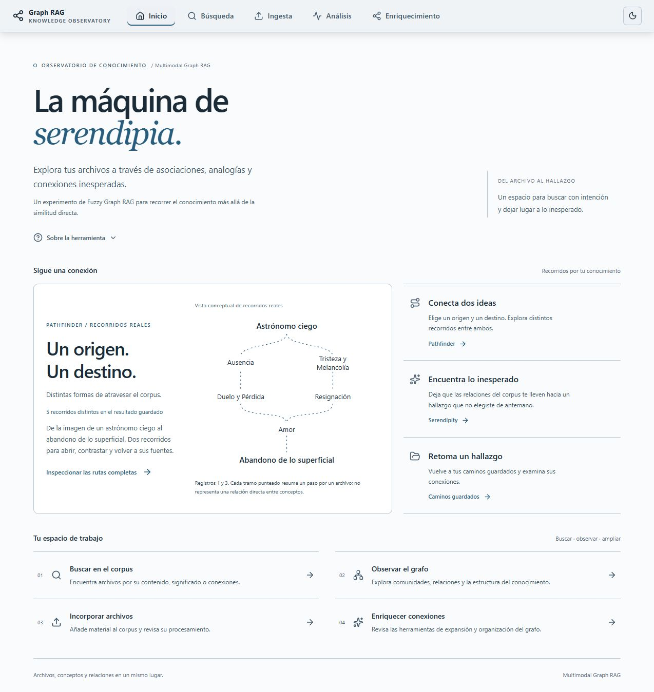
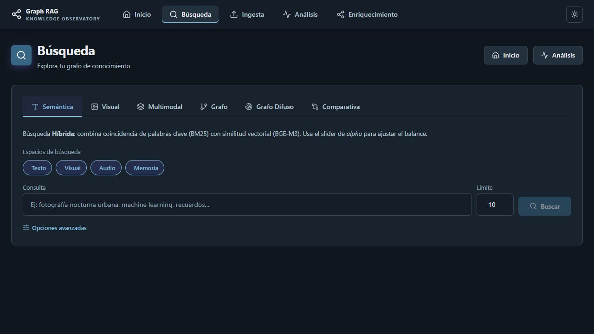
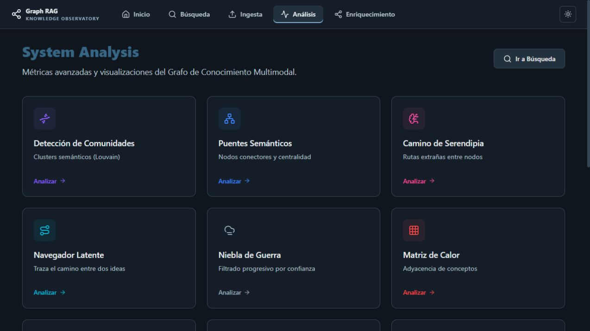
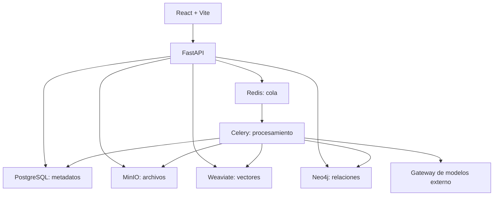

# GraphRAG Multimodal — Observatorio de conocimiento

**Español** · [English](README.en.md)

De la recuperación a la asociación y el descubrimiento serendípico.

GraphRAG Multimodal / The Associative Engine es un observatorio de conocimiento experimental que combina recuperación multimodal, un grafo de conocimiento y relaciones con pesos difusos.

El proyecto parte de una pregunta de investigación:

> ¿Puede un sistema de conocimiento ayudarnos a descubrir relaciones que no sabíamos que estábamos buscando?

## Motivación intelectual

Dos influencias motivaron esta pregunta computacional:

- **Douglas Hofstadter y Emmanuel Sander, *Surfaces and Essences*:** la analogía y su papel en la categorización.
- **Marcel Danesi, *Poetic Logic and the Origins of the Mathematical Imagination*:** el pensamiento poético, la metáfora, la abducción y la creación conceptual.

Son influencias intelectuales, no una validación de la arquitectura. El sistema no pretende modelar ni reproducir la cognición humana. La pregunta de diseño es:

> ¿Cómo sería un sistema de exploración del conocimiento si las relaciones no tuvieran que ser siempre binarias y las asociaciones débiles o indirectas pudieran seguir siendo explorables?

Los grafos con pesos difusos son una respuesta experimental: la hipótesis computacional es que mantener distintos grados de relación disponibles para recorrerlos puede ofrecer pistas de investigación más allá de la similitud directa.

La recuperación convencional optimiza principalmente la relevancia. GraphRAG combina esa búsqueda con la exploración de relaciones más débiles, indirectas e inesperadas mediante recorridos por el grafo difuso, Pathfinder y Serendipity.

El sistema combina búsqueda multimodal, un grafo de conocimiento y relaciones con pesos difusos para explorar documentos, imágenes, audio y video. Su propósito es recuperar material relevante y hacer visibles posibles conexiones entre archivos, conceptos y entidades: del archivo al hallazgo.

Tres formas de explorar el mismo corpus:

- **Recuperación:** buscar lo relevante para una consulta.
- **Pathfinder:** elegir un origen y un destino e inspeccionar distintos recorridos posibles entre ambos.
- **Serendipity:** dejar abierto el destino para que sus propias reglas de exploración propongan una asociación inesperada. No es otra versión de Pathfinder ni requiere que este reproduzca sus resultados.

El ejemplo público **Astrónomo ciego ↔ Abandono de lo superficial** muestra cinco secuencias guardadas. La Home condensa dos; los archivos y relaciones completos permanecen inspeccionables. Ilustra un comportamiento del corpus, no una validación general. Consulta la [curaduría y sus límites](docs/presentation/CANONICAL_EXAMPLE.md), el [guion de 3–5 minutos](docs/presentation/DEMO.md), la [lista de capturas](docs/presentation/CAPTURES.md) y las [direcciones de investigación futura](docs/research/FUTURE_WORK.md).



*Home en modo claro: dos recorridos reales condensados entre Astrónomo ciego y Abandono de lo superficial. Las líneas punteadas omiten archivos intermedios; no son relaciones directas entre conceptos.*

## ¿Para qué sirve?

- **Recuperar conocimiento:** encontrar archivos por palabras, significado o similitud visual.
- **Relacionar ideas:** recorrer conceptos, personas, lugares y otras entidades vinculadas a los archivos.
- **Investigar conexiones:** trazar caminos entre dos nodos con Pathfinder o explorar recorridos de Serendipity.
- **Revisar el corpus:** inspeccionar comunidades, nodos aislados y pesos; enriquecer y depurar relaciones.

Por ejemplo, una colección de notas, fotografías y entrevistas puede explorarse por un tema común y después por las conexiones entre sus entidades. Es un ejemplo de uso; los resultados dependen del material incorporado, los modelos y la calidad del grafo.

Un peso difuso entre 0 y 1 representa la fuerza de una relación según el método usado; no es una probabilidad de verdad. Los recorridos inesperados son pistas de investigación, no conclusiones. El sistema expone los caminos y el material de origen para la evaluación humana: inspecciona cada vínculo, abre los archivos y contrasta su contenido antes de decidir si una conexión es significativa.

## Del archivo al hallazgo

1. **Incorpora** archivos o texto en Ingesta y Agrupación.
2. **Procesa y revisa** las tareas y las entidades propuestas.
3. **Busca** contenido en los espacios de texto, visual, audio y memoria.
4. **Explora** relaciones, caminos y estructura del grafo.
5. **Retoma** los recorridos que hayas guardado.

### Buscar en varios modos



*La búsqueda semántica combina palabras clave (BM25) y similitud vectorial. Las pestañas permiten cambiar la pregunta que haces al corpus.*

| Modo | Para qué usarlo |
|---|---|
| Semántica | Consultar por texto y ajustar el balance entre palabras y significado. |
| Visual | Buscar contenido parecido a una imagen mediante SigLIP. |
| Multimodal | Combinar imagen y texto. |
| Grafo | Recorrer relaciones explícitas con un umbral de peso. |
| Grafo Difuso | Partir de similitud vectorial y expandir las conexiones del grafo. |
| Comparativa | Contrastar los sistemas de recuperación disponibles. |

### Explorar conexiones



*El panel reúne herramientas para estudiar la estructura del corpus y descubrir recorridos. Pathfinder conecta dos nodos; Serendipity permite explorar conexiones inesperadas.*

El análisis incluye comunidades, puentes semánticos, Pathfinder, Serendipity, niebla de guerra, matriz de calor, cuerdas, árbol radial, PageRank, conceptos abstractos, huérfanos, distribución de pesos y caminos guardados. Enriquecimiento reúne ajustes de pesos, expansión de conexiones y limpieza de entidades.

Las capturas son de la app local, con su interfaz en español y algunos nombres en inglés. La Home muestra el ejemplo real guardado; las demás capturas muestran navegación y configuración, sin simular resultados. La [guía visual](docs/general/USAGE_GUIDE.md) explica ingesta y Pathfinder paso a paso.

## Puesta en marcha

Desde la raíz del repositorio, con Docker y Compose v2:

```powershell
# Conserva tu .env si ya tienes uno.
if (!(Test-Path .env)) { Copy-Item .env.docker .env }
# Ajusta credenciales y LLM_GATEWAY_URL antes de arrancar.
docker compose up --build -d
docker compose ps
```

Abre la [app](http://localhost) y la [API interactiva](http://localhost:8000/docs).

El gateway de modelos es externo: Compose no lo incluye. Las operaciones con modelos necesitan un gateway compatible con los clientes del backend. Para transcripción, activa un perfil Whisper: `cpu` o `gpu`. Comunidades y PageRank requieren GDS; el Compose principal solo instala APOC, por lo que esas herramientas necesitan una instalación compatible de GDS.

Consulta la [guía de arranque](docs/general/QUICKSTART.md) para puertos, perfiles y desarrollo local.

## Cómo se organiza



| Ubicación | Contenido |
|---|---|
| `search-app/` | Interfaz React, TypeScript y Vite. |
| `backend/app/` | API, modelos, esquemas y servicios. |
| `backend/worker/` | Procesamiento asíncrono con Celery. |
| `backend/shared/` | Clientes de almacenamiento y bases de datos. |
| `frontend/` | Panel Streamlit heredado. |
| `docs/` | Guías, referencias y capturas. |
| `docker-compose.yml` | Aplicación e infraestructura. |

## Documentación

- [Índice en español](docs/README.md) · [English documentation](docs/en/README.md)
- [Arranque](docs/general/QUICKSTART.md) · [Guía visual de uso](docs/general/USAGE_GUIDE.md)
- [Arquitectura](docs/general/ARCHITECTURE.md) · [Diagramas](docs/general/diagrams.md)
- [Lógica difusa](docs/backend/FUZZY_LOGIC.md) · [Enriquecimiento](docs/backend/enrichment_summary.md)
- [Frontend React](search-app/README.md) · [Resolución de problemas](docs/backend/TROUBLESHOOTING.md)

El español es el idioma principal. La introducción, el arranque y la guía visual también están disponibles en inglés; el índice inglés identifica las referencias técnicas que siguen en español.

## Licencia

GNU AGPL v3. Consulta [LICENSE](LICENSE).

## Cómo citar este proyecto (Citation)

Si utilizas **hechoconcafeina** o la arquitectura de Graph RAG con lógica difusa en tu investigación, por favor cita nuestro trabajo:

```bibtex
@misc{hechoconcafeina2026,
  author    = {Romero Hernandez, Fabian},
  title     = {hechoconcafeina: A Fuzzy Logic-based Multimodal Graph RAG System},
  year      = {2026},
  publisher = {GitHub / Zenodo},
  journal   = {GitHub repository},
  howpublished = {\url{https://github.com/CoffeESIME/fuzzy-graph-rag}},
  doi       = {[DOI-generado-por-Zenodo-proximamente]}
}
```
