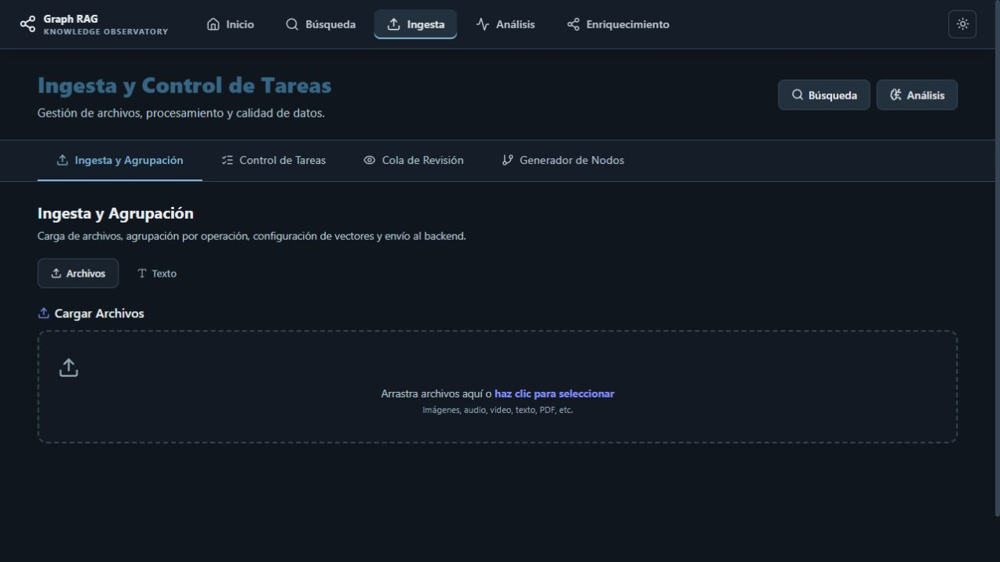
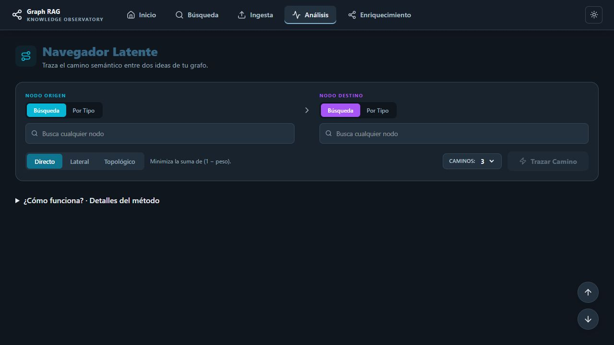

# Guía visual de uso — GraphRAG

**Español** · [English](../en/USAGE_GUIDE.md) · [Índice](../README.md)

El objetivo es convertir un conjunto de archivos en un corpus que puedas buscar y explorar por sus relaciones. Antes de empezar, sigue el [arranque](QUICKSTART.md). Para obtener resultados necesitas archivos procesados, vectores en los espacios consultados y relaciones en el grafo.

Las capturas muestran la app real en su estado inicial de navegación y configuración; no representan resultados ni métricas de un corpus de demostración.

## 1. Incorporar material

Abre **Ingesta → Ingesta y Agrupación**. La página de Ingesta abre inicialmente Control de Tareas, así que selecciona la pestaña de agrupación para cargar material.

*Archivos permite cargar material multimedia; Texto permite incorporar contenido escrito. La agrupación y los vectores se configuran después de añadir material.*

1. Selecciona archivos o introduce texto.
2. Configura los grupos y operaciones que necesites: Standard conserva el procesamiento individual; Merge OCR agrupa material para extracción de texto.
3. Selecciona los tipos de procesamiento adecuados al contenido: texto, representación visual, transcripción o memoria, según las opciones disponibles.
4. Envía los grupos y revisa su estado en **Control de Tareas**.

Las tareas pueden pasar por `ON_HOLD → PENDING → PROCESSING → COMPLETED`, o terminar con error. Una tarea en espera necesita activación; cargar un archivo no significa que ya esté indexado. Revisa las tareas fallidas antes de reintentarlas.

En **Cola de Revisión**, inspecciona las entidades y relaciones propuestas antes de aprobarlas. **Generador de Nodos** permite trabajar manualmente con nodos y conexiones.

## 2. Buscar contenido

*Elige primero qué representación del contenido quieres consultar: Texto, Visual, Audio o Memoria. Solo habrá resultados si ese espacio tiene vectores para tu material.*

En **Búsqueda → Semántica**, escribe una consulta, elige espacios y límite y pulsa **Buscar**. En **Opciones avanzadas** puedes ajustar el balance híbrido: alpha 0 prioriza BM25, alpha 1 usa similitud vectorial y los valores intermedios combinan ambos.

| Pestaña | Pregunta que ayuda a responder |
|---|---|
| Semántica | ¿Qué archivos hablan de esta idea? |
| Visual | ¿Qué imágenes se parecen a esta referencia? |
| Multimodal | ¿Qué contenido coincide con esta imagen y esta descripción? |
| Grafo | ¿Qué entidades están conectadas mediante relaciones explícitas? |
| Grafo Difuso | ¿Qué vecinos aparecen al expandir una búsqueda por similitud? |
| Comparativa | ¿Cómo cambian los resultados entre sistemas de recuperación? |

Abre la previsualización o el archivo original para contrastar el resultado. Una puntuación de recuperación ordena coincidencias; no demuestra que una afirmación sea verdadera. El alpha de búsqueda híbrida y el umbral de relaciones del grafo tienen funciones distintas.

## 3. Conectar dos ideas con Pathfinder

Desde Inicio, selecciona **Conecta dos ideas**, o abre `/analysis/pathfinder`. La pantalla se titula **Navegador Latente**.

*Los dos selectores definen los extremos del recorrido. El modo cambia el criterio con el que se buscan caminos.*

1. Busca y selecciona un nodo de origen y uno de destino; también puedes usar **Por Tipo**.
2. Elige **Directo**, **Lateral** o **Topológico** y el número de caminos.
3. Abre **¿Cómo funciona? · Detalles del método** para consultar los criterios. El modo Directo minimiza la suma de `1 − peso`.
4. Pulsa **Trazar Camino** y examina las relaciones del recorrido y sus archivos de origen.
5. Si guardas un recorrido, puedes volver a él desde **Caminos guardados** (`/analysis/saved-paths`).

Si no hay un camino, comprueba los nodos elegidos y la conectividad del corpus; no todos los pares tienen una ruta.

## 4. Descubrir y analizar

*El panel ofrece distintas vistas del mismo conocimiento: agrupaciones, conexiones, recorridos y calidad del grafo.*

**Serendipity** (`/analysis/serendipity`) sirve para seguir un recorrido exploratorio. **Comunidades** agrupa conceptos; **Puentes Semánticos** ayuda a identificar conectores. Las vistas de calor, cuerdas y árbol radial muestran otras formas de relación. Huérfanos y distribución de pesos ayudan a revisar la estructura.

Comunidades y PageRank necesitan GDS, que no está instalado por el Compose principal. Consulta la [guía de arranque](QUICKSTART.md) si estas herramientas devuelven errores.

## 5. Enriquecer y evaluar los hallazgos

En **Enriquecimiento** (`/enrichment`) se reúnen herramientas para ajustar pesos, descubrir conexiones y limpiar entidades. Revisa las propuestas y el alcance de cada operación antes de modificar tu grafo.

Los pesos difusos expresan grados de relación según el método, no probabilidades verificadas. Consulta los archivos originales, el razonamiento disponible y los [detalles de lógica difusa](../backend/FUZZY_LOGIC.md). Una conexión sugerida es una hipótesis que investigar.

## Si no aparecen resultados

- Comprueba que las tareas terminaron y que seleccionaste un espacio con vectores.
- Revisa filtros, umbrales y conectividad del grafo.
- Si hay errores de API, revisa backend, worker y gateway siguiendo el [arranque](QUICKSTART.md).
- Si el archivo no abre, comprueba el acceso a MinIO; los puertos del anfitrión y de los contenedores son distintos.

Consulta también [resolución de problemas](../backend/TROUBLESHOOTING.md).
