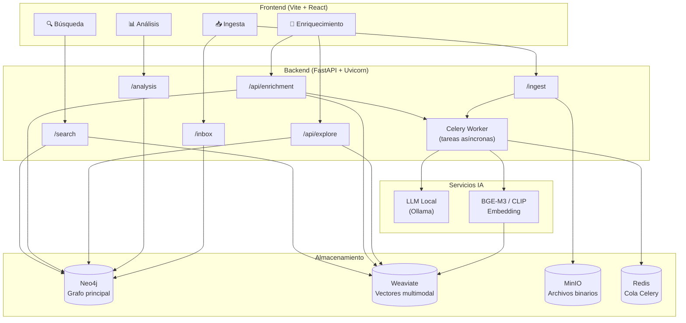
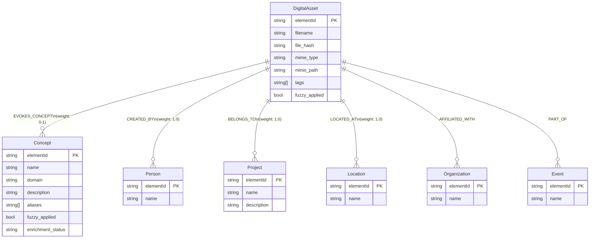
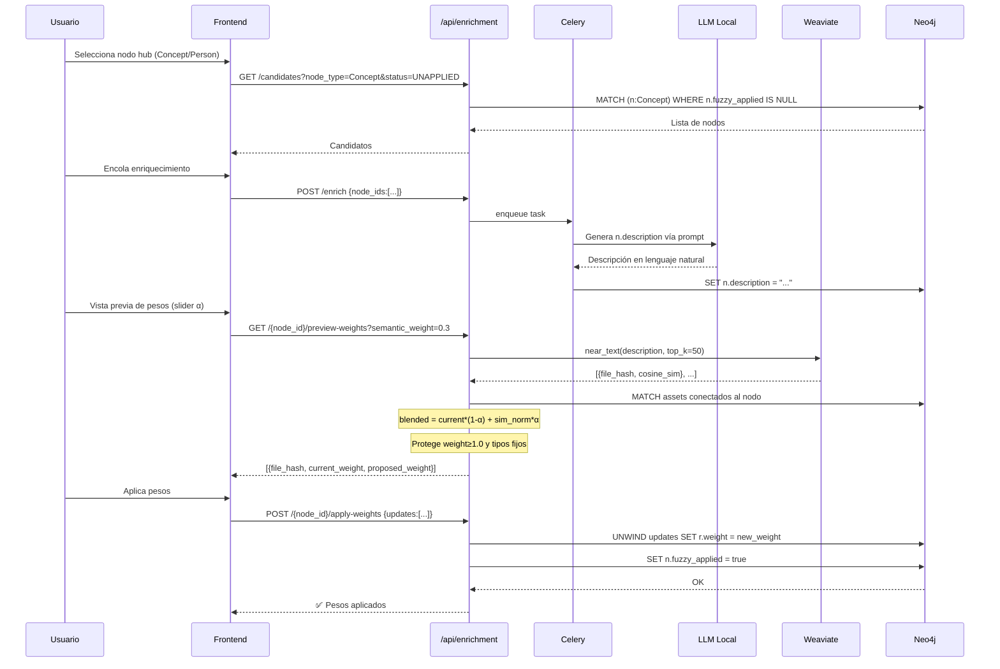
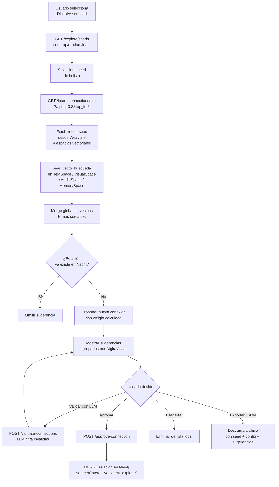
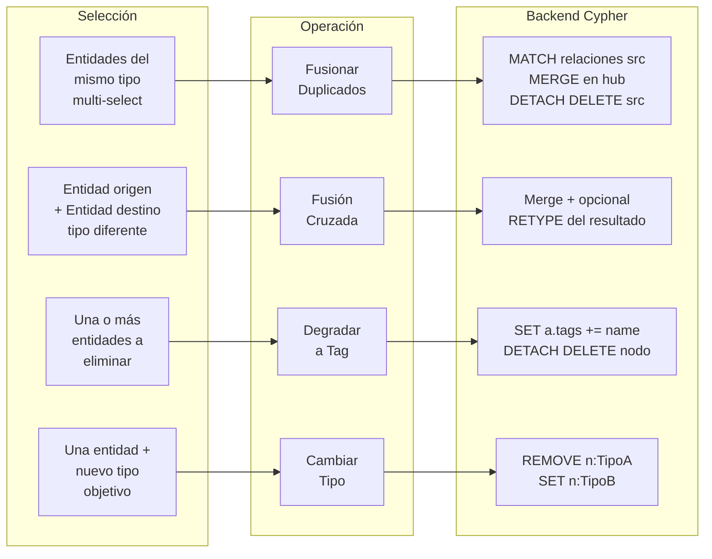
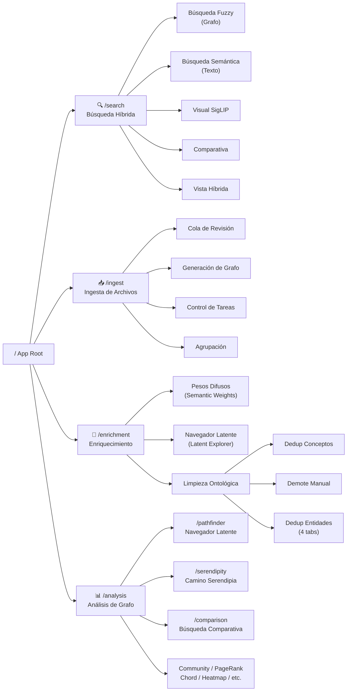

# GraphRAG — Diagramas de Documentación

---

## 1. Arquitectura del Sistema

---

## 2. Modelo de Datos — Neo4j

---

## 3. Pipeline de Enriquecimiento Semántico

---

## 4. Búsqueda Latente (Latent Explorer)

---

## 5. Operaciones de Dedup de Entidades

---

## 6. Navegación Frontend

